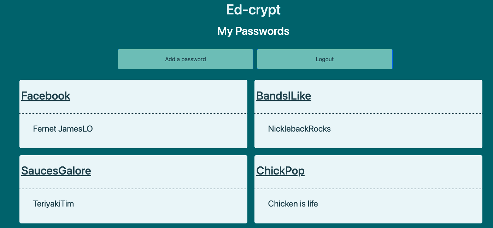
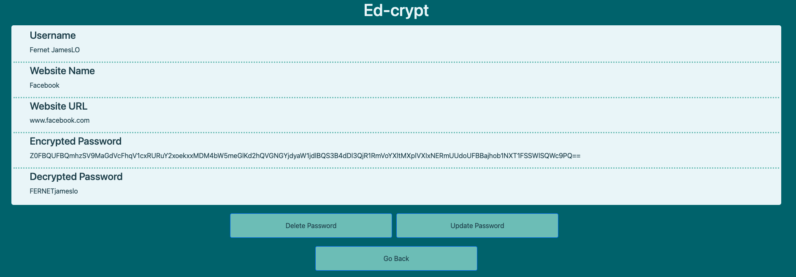

# Ed-crypt

## Brief:

- Build a full-stack application by making your own backend and your own front-end
- Use a Python Django API using Django REST Framework to serve your data from a Postgres database
- Consume your API with a separate front-end built with React
- Be a complete product which most likely means multiple relationships and CRUD functionality for at least a couple of models
- Implement thoughtful user stories/wireframes that are significant enough to help you know which features are core MVP and which you can cut
- Be deployed online so it's publicly accessible.

## Overview and Concept:

This was a solo project and our final project, we had nine days to complete our work. I spent a bit of time thinking about what I wanted to do for this project. I could either play it safe and create a wildlife website or take a risk and try something we hadn’t been taught.

Throughout the course we were told to keep our passwords secure, and there were constantly times where people forgot their passwords. So I decided to make a password vault.

Getting started took longer than the previous projects as I had to fully research various encryption and decryption methods, then the difference between encryptions and salting which took it’s time until I found Cryptography.py and once I read through its documentation I knew it was exactly what I needed, this took me two days to get completed.

The main point of my application is to encrypt and decrypt passwords for the user, so I didn't want to clutter it with other content and thought a simpler, more refined look would suit it best.


## Technologies Used:

### Back-end:

- Django
- Python
- Django Rest-Framework
- Psycopg2
- pyJWT
- Cryptography

### Front-End:

- React
- SASS
- Axios
- Http-proxy-middleware
- Nodemon
- React router DOM

### Development Tools:

- VS Code
- Yarn
- Insomnia
- Git
- Heroku
- Asana
- Figma
- Coolers (colour theme)

## Visuals






## Build:

The first aspect I started with was building out my user model and adding some authentication to the login process. For this I incorporated some basic authentication from the Django rest framework and created a secret key to create our tokens using the HS256 algorithm. The next step was to set up an Admin account to check out the localhost server and whether I had carried everything out correctly.

```

from rest_framework.authentication import BasicAuthentication
from rest_framework.exceptions import PermissionDenied
from django.contrib.auth import get_user_model
from django.conf import settings
import jwt
User = get_user_model()


class JWTAuthentication(BasicAuthentication):
    def authenticate(self, request):
        header = request.headers.get('Authorization')
        if not header:
            return None
        if header.startswith('Basic'):
            return None
        if not header.startswith('Bearer'):
            raise PermissionDenied({'message': 'Invalid authorization header'})
        token = header.replace('Bearer ', '')
        try:
            payload = jwt.decode(
                token, settings.SECRET_KEY, algorithms=['HS256'])
            user = User.objects.get(pk=payload.get('sub'))
        except jwt.exceptions.InvalidTokenError:
            raise PermissionDenied({'message': 'Invalid Token'})
        except User.DoesNotExist:
            raise PermissionDenied({'message': 'User not found'})
        return (user, token)

```

Testing the encryption and decryption:

```

from cryptography.fernet import Fernet
import os
from dotenv import load_dotenv

load_dotenv()

FERNET_KEY = os.getenv('FERNET_KEY')

fernet = Fernet(FERNET_KEY)

#txt = 'my secret'
#encypted_text = fernet.encrypt(txt.encode())
# print(encypted_text)
#decrypted_text = fernet.decrypt(encypted_text).decode()
# print(decrypted_text)

```

Before I settled on Cryptography I did a test with a string and tried to encrypt and decrypt that, having done that easily enough I started building out my website. The build started very smoothly and I had encryption sorted by lunchtime on the fourth day. However the decryption took longer, once I realised that it wasn’t to do with the encryption itself but actually the way I was storing the data in my database the answer was simple enough. I changed the model to store the passwords as binary, which encrypted it. This enabled me to decrypt it as bytes.

```

class Input(models.Model):
    username = models.CharField(max_length=100)
    sitename = models.CharField(max_length=100)
    websiteurl = models.CharField(max_length=100)
    password = models.BinaryField(max_length=400)
    user = models.ForeignKey("jwt_auth.User", on_delete=models.CASCADE)

    def __str__(self):
        return "Username: " + self.username + ' Site_Name: ' + self.sitename + ' Website_url: ' + self.websiteurl

    def decryption_method(self):
        txt = self.password
        print('TXT', txt)
        dec_pass = decryption(txt)
        print('MAYBE DEC', dec_pass)
        return dec_pass

```

I created the views.py folder and started to work through my requests the API would need to manage. I knew that the only points I would need to encrypt anything would be on a post request so I implemented my test code and created my encryption function within each request.

```

# CREATING CRYPTOGRAPH ENCRYPTION
def encryption(txt):
    encpass = fernet.encrypt(txt.encode())
    print('ENCRYPTION :', encpass)
    return encpass

```

I also had API requests for all other CRUD capabilities. However I thought it would be best to present the one using the encryption function I created. From what I’ve gathered in my research a fernet token is a bearer token that represents user authentication. The fernet tokens contain a limited amount of identity and authorization data in a payload. This payload is wrapped as a Fernet message for transport. The data inside a fernet token is protected using fernet keys.

Fernet keys are what's used to encrypt and decrypt the fernet tokens. Each key is actually composed of two smaller keys; an encryption key and a signing key. Both of which are held in a secure location that keystone passes to a library that handles the encryption and decryption of the fernet tokens.

Once I had managed to decrypt my data, I realised that my presentation would be over in an instant if I couldn’t show them the data in it’s decrypted state, so I included it on the page, which I know compromised the integrity of the website but showed the work I had done. It was at this point when I thought about the responsibility I would take on by deploying this website to the web, which initially I thought was fine so deployed, but having thought on it more and any form of legal issues if it breaks I decided to take it down.

I added a React front end and used my new found love of Bootstrap to create all my forms.


The edit a password form also brings through the current inputted data and automatically fills the form input boxes to make it as seamless as possible.

I also used the bearer tokens generated in the back end to create a helper folder of easy functions, to try and make my code as DRY as possible. These could then be brought in on any of my front end requests and check the tokens match.

```

export const getToken = () => {
  return window.localStorage.getItem('token')
}

export const setToken = (token) => {
  window.localStorage.setItem('token', token)
}

export const removeToken = () => {
  window.localStorage.removeItem('token')
}

```

```
const handleSubmit = async (event) => {
    event.preventDefault()
    try {
      const response = await login(data, 'post')
      console.log('RESPONSE TOKEN', response)
      setToken(response.token)
      setIsError(false)
      redirect()
    } catch (err) {
      console.error(err)
      setIsError(true)
    }
  }

```

## Challenges and Wins:

The biggest challenge was to learn Cryptography from the documentation. The encryption side of things was easy enough but the decryption was harder due to how I stored the data in my database and needing to convert it into bytes. However once I got that figured out I thoroughly enjoyed this project.

A challenge I didn’t think of when I started was actually the responsibility for when it was deployed. Because of this and the raw data being inputted into this page I decided to take down this website.

However the big win for me is pushing myself and getting a fully operational final project by the deadline.

## Future Features

The next steps I will add are to have multiple keys for encryption which are selected at random, then on decryption it goes through all of the keys to figure out which one is the correct fit for the encryption. This will increase its security massively.
